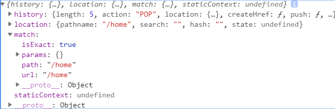

# React Rouer

## SPA单页应用的原理（路由的作用）：
通过监听路由的变化，去匹配路由所对应的组件，并将组件映射到路由上

## 路由的构成
React Router中有三类组件:
1、router 组件（BrowserRouter，HashRouter） 
> 对应路由的两种模式hash和history
2、route matching 组件（Route，Switch） 
> 控制路径对应显示的组件
3、navigation 组件（Link）

## 两种实现形式：
1、Hash路由
2、BrowserRouter：利用H5的Api实现路由切换

## HashRouter一个简单的过程梳理
1、我们通过定义一个HashRouter组件并内部通过state进行状态管理,默认状态：路由为#/。
2、当改变hash值的时候通过监听window.addEventListener('hash', callBack)事件，
3、当hash发生改变的时候修改window.location.pathname的值
4、通过React16.3版本新增的一个API React Context进行数据共享
5、父组件作为Provider(生产者),嵌套其下的组件为Consumer(消费者)
6、route matching 组件通过父组件传递的component、path与window.location的pathname进行匹配并进行组件渲染
7、组件渲染通过一个正则表达式，这里我用到了 path-to-regexp 这个插件进行试验


## HashRouter实现原理

父组件向子、曾组件传值
Provider Consumer

// 路径转正则
> npm install path-to-regexp --save

## React Context
_该api是react16.3版本提出的
* Context通过组件树提供一个传递数据的方法
优点：可以解决父组件向子组件、孙子孙子...传值,为多组件嵌套数据传递提供解决方案。
缺点：
* API
```
const { Provider, Consumer } = React.createContext()
```
Provider(生产者)：用于生成共享数据并被Consumer(消费者)接收
```
  // 父级组件
  <Provider value={value}>
    {
      this.props.children
    }
  </Provider>
```
Consumer(消费者)：嵌套在生产者下面的方式，通过回调拿到数据
```
  <Consumer>
    {/* 跨组件的数据传递 */}
    {
      state => {
        let {path, component: Component} = this.props
        let pathname = state.location.pathname
        let reg = pathToRegexp(path, [], {end: false})
          console.log(path, pathname)
          // 判断当前path是否包含pathname
          if(pathname.match(reg)) {
            return <Component></Component>
          }
        return null
      }
    }
  </Consumer>
```

## 什么是window.location?window.history?
我们知道`DOM`是一套操作HTML标签的API(包括接口、方法、属性)
而`BOM`是一套操作浏览器的API，而window是BOM中的一个顶级的对象，我们可以通过this.props打印挂载在window下的一些信息
